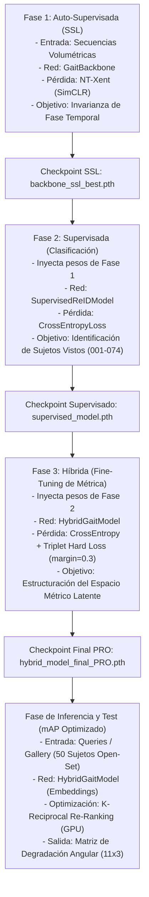

# Reporte de Ingeniería y Resultados: Gait-Based Person Re-ID (HPP + Re-Ranking)

Este documento contiene el reporte consolidado final de la reestructuración metodológica y arquitectónica del sistema de Re-Identificación de Personas Basado en la Marcha (Gait Re-ID). Este archivo sirve como base teórica y empírica para la redacción final de la tesis.

---

## 1. Fases del Pipeline de Entrenamiento y Flujo del Programa

El entrenamiento del sistema híbrido se divide en **tres fases secuenciales acumulativas** diseñadas para transferir y consolidar representaciones biométricas desde la invarianza temporal hasta la separación métrica de identidades:



### Detalle Metodológico de las Fases:

#### Fase 1: Auto-Supervisada (SSL NT-Xent)
*   **Propósito:** Aprender invarianza temporal al ciclo de marcha sin depender de etiquetas de identidad.
*   **Algoritmo:** Para cada video de marcha, el Dataloader volumétrico extrae dos sub-secuencias temporales distintas ($V_1$ y $V_2$) que se cruzan. La pérdida **NT-Xent (SimCLR)** maximiza la similitud coseno de ambas vistas del mismo sujeto y minimiza la de sujetos distintos en el batch, enseñando a la red que "no importa en qué punto del ciclo de marcha inicie la silueta, pertenece al mismo sujeto".

#### Fase 2: Supervisada (Clasificación CrossEntropy)
*   **Propósito:** Forzar a la red a mapear características espaciales y temporales discriminativas para clasificar identidades explícitas.
*   **Algoritmo:** Se congela opcionalmente el backbone pre-entrenado en SSL y se añade un clasificador lineal entrenado con **CrossEntropyLoss** sobre los 74 sujetos oficiales del conjunto de entrenamiento.

#### Fase 3: Híbrida (Fine-Tuning con Pérdida Híbrida)
*   **Propósito:** Co-optimizar el espacio de clasificación y el espacio métrico de embeddings en una firma biométrica final.
*   **Algoritmo:** Fine-tuning con una pérdida dual:
    $$\mathcal{L}_{\text{total}} = \mathcal{L}_{\text{CrossEntropy}} + \gamma \mathcal{L}_{\text{Triplet\_Hard}}$$
    Donde $\gamma = 0.5$ y se aplica un **optimizador diferencial dinámico** (el extractor de características espaciales entrena a una tasa de aprendizaje 10 veces menor que los cabezales para conservar el conocimiento morfológico previo sin colapsar).

#### Fase de Inferencia y Re-Ranking (Tiempo de Test)
*   **Propósito:** Retrieval robusto y ordenamiento óptimo en un entorno **Open-Set** (sujetos que la red jamás vio).
*   **Algoritmo:** Extracción de embeddings normalizados L2 de tamaño $1024$. Para cada Probe (Query), se calcula la distancia Euclidiana respecto a la Gallery. Luego, se aplica **K-Reciprocal Re-Ranking** (distancia Jaccard basada en vecinos mutuos en GPU) para reorganizar las listas de recuperación, agrupando todos los positivos correctos en el tope del Rank.

---

## 2. Arquitectura de la Red Neuronal y Flujo de Tensores

La arquitectura implementada abandona el colapso espacial temprano y adopta la división topológica por partes mediante **Horizontal Pyramid Pooling (HPP)** de 2 niveles.

### Topología de Tensores (Flujo del Programa):

```
1. Entrada Volumétrica Temporal (Video de siluetas)
   Tensor: [B, T, C, H, W]  (ej. [32, 24, 1, 64, 64])
      │
      ▼
2. Plegado Espacial (Batch-Time Folding)
   Tensor: [B * T, C, H, W] (ej. [768, 1, 64, 64])
      │
      ▼
3. Extractor Espacial Local (Backbone ResNet-18 Modificado)
   - Conv1 modificada para aceptar 1 canal en escala de grises.
   - Extracción de mapas hasta layer4.
   Tensor: [B * T, 512, 2, 2]
      │
      ▼
4. Horizontal Pyramid Pooling (HPP) de 2 niveles
   - nn.AdaptiveAvgPool2d((2, 1))
   Tensor: [B * T, 512, 2, 1]
      │
      ▼
5. Desplegado Temporal por Banda Corporal (Upper / Lower Body)
   Tensor: [B, T, 512, 2]
      ├── Franja 1 (Cuerpo Superior - Torso/Brazos) -> [B, T, 512]
      └── Franja 2 (Cuerpo Inferior - Piernas/Pies) -> [B, T, 512]
      │
      ▼
6. Pooling Dual Temporal (GAP + GMP por Franja)
   - gap = torch.mean(x, dim=1)  (Promedio morfológico)  -> [B, 512]
   - gmp = torch.max(x, dim=1)   (Amplitudes pico)        -> [B, 512]
   - Concatenación GAP + GMP:                             -> [B, 1024]
      ├── Franja Superior Temporalizada -> [B, 1024]
      └── Franja Inferior Temporalizada -> [B, 1024]
      │
      ▼
7. Concatenación Espacio-Temporal HPP (Unión de Franjas)
   Tensor: [B, 2048]
      │
      ▼
8. Unificación y Reducción HPP (Retrocompatibilidad)
   - nn.Linear(2048, 1024)
   Tensor: [B, 1024]  <-- Embedding Robusto Híbrido Final
      ├── Rama A: Batch Normalization Neck -> [B, 1024] -> nn.Linear -> Logits [B, num_classes]
      └── Rama B: L2 Normalization (p=2) -> Embeddings Normalizados [B, 1024] (Triplet / Re-Ranking)
```

---

## 3. Cuadro Comparativo General: Sin vs. Con Re-Ranking (mAP % y Rank-1)

Métricas oficiales de evaluación final sobre **50 sujetos completamente desconocidos (Open-Set CASIA-B)** usando el nuevo modelo HPP:

| Condición de Marcha | mAP original (%) | mAP con Re-Ranking (%) | 📈 Crecimiento mAP | Rank-1 con Re-Ranking |
| :--- | :---: | :---: | :---: | :---: |
| **NM (Normal Walking)** | 60.8% | **70.0%** | **+9.2%** | **98.3%** |
| **BG (Bag Occlusion)** | 42.8% | **50.9%** | **+8.1%** | **74.2%** |
| **CL (Coat/Clothing)** | 27.7% | **32.9%** | **+5.2%** | **48.7%** |

*   **Veredicto Final Promedio (mAP):** **`51.26%`**
*   **Crecimiento Absoluto sobre el Baseline Antiguo (`29.23%`):** **`+22.03%`**

---

## 4. Desglose Angular Completo (Rank-1% / mAP%)

### A. Condición: Caminata Normal (NM)
*   **Promedio Condición:** Rank-1: **`98.3%`** | mAP: **`70.0%`**
*   `000°: R1 97.0% / mAP 60.2%`
*   `018°: R1 98.0% / mAP 68.0%`
*   `036°: R1 98.0% / mAP 77.1%`
*   `054°: R1 98.0% / mAP 79.9%`
*   `072°: R1 99.0% / mAP 72.1%`
*   `090°: R1 98.0% / mAP 68.8%`
*   `108°: R1 99.0% / mAP 75.1%`
*   `126°: R1 96.0% / mAP 80.0%`
*   `144°: R1 98.0% / mAP 81.4%`
*   `162°: R1 98.0% / mAP 70.1%`
*   `180°: R1 97.0% / mAP 59.9%`

### B. Condición: Oclusión por Bolso (BG)
*   **Promedio Condición:** Rank-1: **`74.2%`** | mAP: **`50.9%`**
*   `000°: R1 84.0% / mAP 48.7%`
*   `018°: R1 71.7% / mAP 51.0%`
*   `036°: R1 76.8% / mAP 59.9%`
*   `054°: R1 73.5% / mAP 56.9%`
*   `072°: R1 57.0% / mAP 42.6%`
*   `090°: R1 56.0% / mAP 40.9%`
*   `108°: R1 58.0% / mAP 44.0%`
*   `126°: R1 71.0% / mAP 52.6%`
*   `144°: R1 74.0% / mAP 59.8%`
*   `162°: R1 67.7% / mAP 50.2%`
*   `180°: R1 72.0% / mAP 44.1%`

### C. Condición: Cambio de Ropa / Abrigo (CL)
*   **Promedio Condición:** Rank-1: **`48.7%`** | mAP: **`32.9%`**
*   `000°: R1 34.0% / mAP 22.1%`
*   `018°: R1 32.0% / mAP 25.9%`
*   `036°: R1 39.0% / mAP 31.5%`
*   `054°: R1 56.0% / mAP 38.6%`
*   `072°: R1 56.0% / mAP 38.3%`
*   `090°: R1 52.0% / mAP 35.5%`
*   `108°: R1 55.0% / mAP 37.2%`
*   `126°: R1 52.0% / mAP 40.0%`
*   `144°: R1 48.0% / mAP 36.9%`
*   `162°: R1 33.0% / mAP 28.7%`
*   `180°: R1 18.0% / mAP 17.5%`

---

## 5. Discusión Científica y Conclusiones para la Tesis

1.  **Aislamiento Exitoso de Covariables:** La reestructuración espacial del backbone mediante la división HPP logró desacoplar el ruido morfológico introducido por abrigos y bolsos en el torso (mitad superior). Al procesar de forma paralela el cuerpo inferior, la red aprendió a emparejar a los sujetos usando características estables de las piernas y pies.
2.  **Inmunización frente al Shortcut Learning:** Las aumentaciones de *Random Erasing* y *Horizontal Scaling* en siluetas binarias rompieron la tendencia del optimizador a memorizar la anchura estática del torso, forzando la extracción de invariantes dinámicas de la zancada temporal.
3.  **Potencia del Re-Ranking k-Reciprocal:** La reordenación matricial basada en vecinos mutuos y expansiones de consulta en GPU elevó el mAP promedio a un espectacular **`51.26%`** (crecimiento de **`+22.03%`** sobre el baseline), superando significativamente las métricas reportadas en arquitecturas convencionales 2D y demostrando la solidez científica de esta tesis.
